# Architecture

Monorepo with pnpm workspaces. `apps/api` is the new TypeScript API; `apps/web` is the legacy React client (rewritten in phase 4).

## Layers

```
GraphQL (SDL) → resolvers → services → repositories → Drizzle → PostgreSQL
```

- **Resolver**: translates GraphQL ↔ service; 1–3 lines, no business logic, no DB access.
- **Service**: validates with Zod, applies authorization (`viewer` required, ownership), throws `AppError`.
- **Repository**: only module that imports Drizzle; returns domain types. Typed against `PgDatabase` so both `pg` and PGlite work without casts.

## Request lifecycle

```mermaid
flowchart LR
    Client --> Hono
    Hono --> CORS[CORS allowlist]
    CORS --> RL[per-IP rate limit]
    RL --> SEC[secure headers + body limit]
    SEC --> Yoga[GraphQL Yoga]
    Yoga --> CSRF[CSRF check]
    CSRF --> Armor[armor limits]
    Armor --> PO[persisted ops]
    PO --> CTX[context: viewer, loaders, services]
    CTX --> Resolvers
    Resolvers --> Services
    Services --> Repositories
    Repositories --> PG[(PostgreSQL)]
```



1. Hono receives the request with a per-request `requestId` and child logger.
2. `httpSecurity`: exact-origin CORS (preflights answered here with 204), general per-IP rate limit (300/min), secure headers, 100 KB body limit.
3. Yoga: CSRF check, armor validation (depth/aliases/directives/tokens/cost), persisted-operation lookup in production, introspection gate.
4. Context is built per request: `viewer` from the session cookie via `services.auth.authenticate`, per-request DataLoaders, services, cookie collector, client IP, logger.
5. Resolvers (1–3 lines) call services; services validate (Zod), authorize (ownership), and call repositories.
6. The response goes back with `Cache-Control: private, no-store`, collected `Set-Cookie` headers, masked errors, and one access log line (method, path, status, duration — no bodies, no cookies).

## Folder structure

```
apps/api/src/
  app.ts                      # createApp(deps): Hono + middlewares + Yoga
  server.ts                   # composition root: env, repos, services, shutdown
  migrate.ts                  # production migration runner
  instrumentation.ts          # OpenTelemetry bootstrap (node --import)
  graphql/
    schema.graphql            # SDL: source of truth
    resolvers/
      index.ts                # merged map (auth + scalars; projects/tasks in 3B)
      auth.ts                 # Query.me, signUp/signIn/signOut
    scalars.ts                # DateTime scalar
    context.ts                # GraphQLContext + cookie collector
    loaders.ts                # DataLoader stubs (real loaders in 3B)
    errors.ts                 # AppError → GraphQLError mapping
    security.ts               # Yoga plugins, persisted manifest loader
    __generated__/            # graphql-codegen output (committed)
  http/
    health.ts                 # /health/live, /health/ready
    security.ts               # CORS, rate limit, headers, body limit
  modules/
    auth/                     # service, password, tokens, cookie, sessions repo
    users/                    # user repository
    projects/                 # service, repository, schemas
    tasks/                    # service, repository, schemas
  infrastructure/
    config/env.ts             # Zod-validated environment (parsed once)
    database/                 # schema.ts, client.ts, migrations/
    logging/logger.ts         # structured JSON logger with redaction
  lib/                        # errors.ts, cursor.ts, rate-limit.ts, client-ip.ts
```

## Dependency direction rules

- Inner layers never import outer ones: repositories don't import services, services don't import resolvers, GraphQL never touches the database.
- `infrastructure/` and `lib/` are imported by anyone but import no domain code (only node builtins, Zod, Drizzle types).
- Module services may use other modules' repositories (wired explicitly in `server.ts`); repositories never cross-import.
- Configuration flows down from `env.ts`: only `server.ts`, `migrate.ts`, and `instrumentation.ts` (OTLP switch only) read `process.env`.

## Cross-cutting

- **Config**: `env.ts` parses `process.env` once at startup; passed down explicitly.
- **Logging**: structured JSON logger with redaction; per-request child logger.
- **Health**: `/health/live` (always 200), `/health/ready` (DB ping).
- **Observability**: OpenTelemetry traces + metrics via OTLP when `OTEL_EXPORTER_OTLP_ENDPOINT` is set.

## Frontend

See [frontend.md](frontend.md): TanStack Router (file-based), TanStack Query, typed documents from graphql-codegen, semantic Tailwind tokens.
